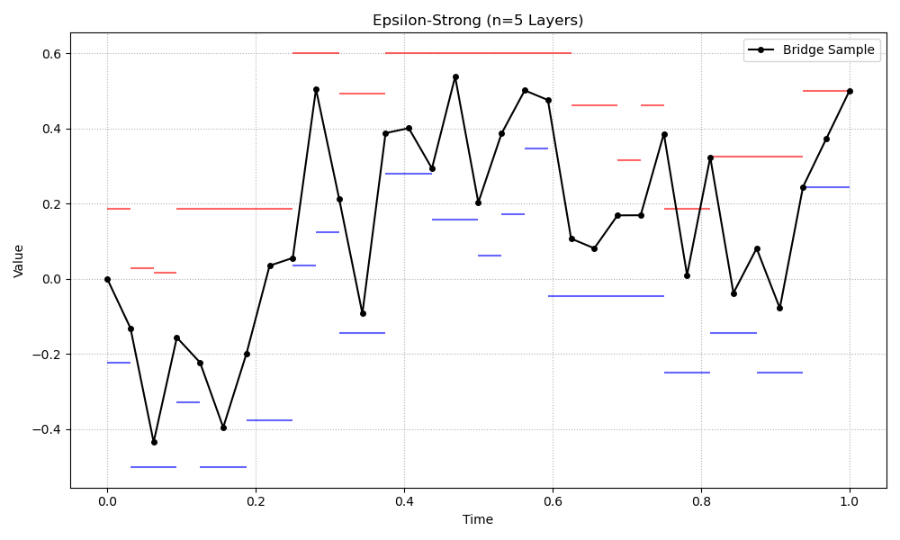

# 🧮 Epsilon-Strong Simulation of Brownian Bridges

This repository implements the **ε-strong algorithm** for the exact simulation of **Brownian bridges**, as introduced in:

> *Beskos, Peluchetti, Roberts (2012)*:
> *“ε-Strong simulation of the Brownian path”*  
> [https://doi.org/10.3150/11-BEJ383](https://doi.org/10.3150/11-BEJ383)

The method builds a **layered structure** around the Brownian bridge, allowing you to:
- Sample the process at intermediate points
- Refine the bounds of the minimum and maximum over time
- Perform rejection sampling using tight alternating series bounds

---

## 📁 Features

- ✅ Simulation of Brownian bridges on \([x,y]\) with custom start and end values  
- ✅ Exact sampling using rejection sampling and inverse transform  
- ✅ Binary tree bisection of the interval into \(2^n\) sub-layers  
- ✅ Automatic refinement of min/max layer intervals  
- ✅ Closed-form midpoint proposal distribution  

---

## 🧰 Requirements

- Python 3.8+
- `numpy`
- `scipy`
- `matplotlib`

Install dependencies with:

```bash
pip install numpy scipy matplotlib
```

---

## 🧠 Algorithm Summary

1. Initialize the bridge with fixed endpoints and initial min/max bounds.
2. Recursively bisect the interval and:
   - Sample midpoint via rejection sampling
   - Update layer bounds using `beta` functions
3. Continue for `n` iterations, yielding `2^n` intervals
4. Optionally refine min/max bounds to within √(Δt) precision

---

## 🖼 Example Output

Below: Sample path from the ε-strong algorithm with `n=5` iterations (32 layers).  
Black points: Bridge path.  
Red lines: Upper bounds.  
Blue lines: Lower bounds.



---

## 🪪 License

This project is distributed under the MIT License. See `LICENSE` for details.
